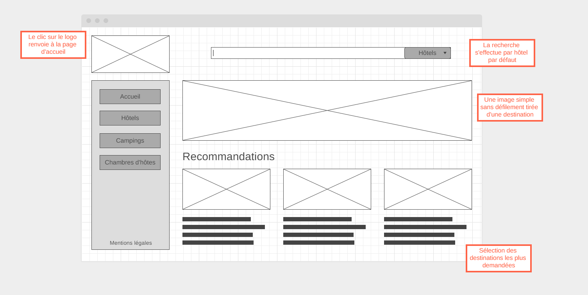
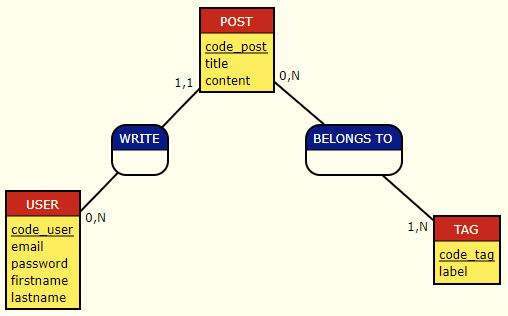

# Concevoir un projet à partir de l'expression d'un besoin

Quand on a découvert la programmation, on a dit qu'on ne pourrait pas trouver de solutions à un problème dans nos programmes si nos objectifs ne sont pas clairs. Et bien c'est la même chose à l'échelle d'un projet. Pour créer la solution qui répond à un besoin, il faut qu'il soit clairement défini au préalable.

## Traduire un besoin

On oeuvrera le plus souvent en équipe aux divers savoir-faire pour répondre à un besoin. Chaque membre de l'équipe doit partager la même vision d'un projet pour construire une solution cohérente. De plus cette vision doit être la même que la vision de celui qui exprime le besoin (le client). Si on me demande de travailler sur un site ecommerce et que je passe 6 mois à développer une interface de gestion de codes promotionnels pour un client qui me dit qu'il n'en a pas l'utilité à la fin du projet, mais que, par contre il aurait voulu un moteur de recherche par critère que je n'ai pas fait, cela peut poser problème.

C'est pourquoi avant d'entamer directement une phase de réalisation d'un projet, on passe par une phase de définition et de conception.

On va voir plusieurs types de documents pouvant être réalisés lors des étapes initiales d'un projet. Ces documents ne sont pas nécessairement réalisés par un développeur, cela peut être à la charge d'un chef de projet, d'un product owner ou autre. En revanche un développeur devra en prendre connaissance pour s'approprier un projet, il est donc nécessaire pour nous de les découvrir.

### User stories

Souvent la formulation initiale d'un projet est un peu brute. C'est une simple idée qu'il va falloir affiner et clarifier pour que chaque membre de l'équipe aille dans la même direction.

Les _user stories_ sont un moyen de retravailler cette formulation initiale afin de lister les besoins d'un projet. Cela représente des objectifs finaux _d'un point de vue utilisateur_, c'est ça leur force. Ainsi on n'est pas déconnecté d'une réelle nécessité pour l'utilisateur final.

Cela se présente ainsi :

**En tant que _qui_ j'ai besoin de _quoi_ afin de _pourquoi_**

Par exemple `En tant qu'utilisateur connecté j'ai besoin de pouvoir modifier mon adresse afin de ne pas recevoir une commande à une adresse obsolète`

On peut noter que la réalisation de user stories fait partie d'une approche _Agile_. _Agile_ est une méthodologie de gestion de projet. Elle encourage la réalisation par itérations successives de plusieurs petites phases de réalisations plutôt qu'une seule grosse. Ces petites phases, appelées **itérations** permettent à chaque fois plus de communication entre les équipes de réalisation et les clients.

### Wireframes

Le wireframe est un schéma qui permet de visualiser les zones des pages types qui vont constituer mon application. En plus de visualiser les zones principales, on y annotera les actions des élements intéractifs de l'interface.

Ils permettent donc de synthétiser visuellement des fonctionnalités attendues sans être trop verbeux. Via la représentation d'une interface utilisateur, on ne s'éloigne pas d'un objectif final et du besoin utilisateur.

De plus il est important de noter qu'il ne s'agit pas d'un prototype graphique, on n'y prend pas de parti graphique (choix de police, couleurs, ...). Ainsi on se concentre uniquement sur les fonctionnalités attendues. Cela permet de les valider avec le client sans devoir reprendre tous les choix graphiques si on retire une zone par exemple. Le prototype graphique pourra venir après.

Il existe des outils en ligne pour réaliser des wireframes comme [wireframe.cc](https://wireframe.cc/), [mockflow](https://www.mockflow.com/) ou [whimsical](https://whimsical.com/)

Exemple d'un wireframe pour une page d'accueil d'un comparateur d'hébergements.

### MCD

Une fois le besoin du client clarifié, on s'est assuré que l'équipe se représente le même but à atteindre.

Il faut ensuite commencer à esquisser comment nous allons atteindre ce but.

Pour une application qui gère des données, on voudra mettre en place une base de données. Une base de données mal conçue, c'est l'assurance d'une fondation instable pour un projet qui partirait sur de mauvaises bases.

On peut appliquer la méthode _Merise_ pour concevoir notre base de données. On tâchera d'éviter les erreurs de conceptions, à savoir principalement la duplication des données.

On va concevoir la base de données en une série d'étapes permettant de se focaliser sur un problème à la fois, à savoir :

1. **Le MCD pour lister les entités, leurs attributs et leurs associations**
2. Le MLD pour traduire les associations
3. Le MPD pour ajouter les contraintes spécifiques à notre DBMS

La première étape est sans doute la plus fondamentale. Nous détaillerons les étapes 2 et 3 lors de la prochaine journée. Commençons aujourd'hui par la première.

Le MCD signifie _Modèle Conceptuel des Données_.

Le but du modèle conceptuel de données est :

- de se réprésenter quelles seront les entités (/ les choses / les types de données) qu'on veut stocker et manipuler.
- et également quelles seront les attributs (/ les propriétés / les caractéristiques) de ces entités.
- et finalement quelles seront les associations (/ les liens) entre nos entités.

A ce stade on ne parle pas encore de table, ce n'est qu'un modèle conceptuel.  
On ne sait pas encore quel DBMS on utilisera, donc on ne se projette pas encore sur l'implémentation physique. Cela viendra lors des étapes suivantes MLD/MPD.

Exemple de MCD

On a ici

- En rouge (POST, USER, TAG) : les entités. A priori dans cette application on gère des articles, des utilisateurs et des catégories.
- Pour chaque entité on a en dessous en jaune (par exemple *code_post*, _title_, _content_) : les attributs. A priori un article est caractérisé par un code, un titre et un contenu par exemple.
- En bleu (WRITE, BELONGS TO) : les associations. Ici un article est écrit par un utilisateur. De plus un article est associé à des catégories.

On remarque qu'un attribut est souligné pour chaque entité. C'est ce qu'on appelle un discriminant. Il s'agira d'une donnée qui devra être unique pour chaque enregistrement (ce seront typiquement nos _id_, mais rappelez vous à ce stade on n'est pas encore dans notre implémentation finale).

L'un des points essentiels du MCD est l'ajout des cardinalités. Ce sont les petits chiffres qu'on voit le long des associations pour les quantifier. Ils permettent de comprendre le type d'associations qu'on va avoir. On va voir plus de détails ci-dessous.

#### Comment réaliser un MCD

1. On commence par lister ce que nous voulons stocker via des entités. 
> Ex : Produit, Client, Salle...
2. Pour chaque entité, on liste en dessous les attributs sans oublier d'ajouter un discriminant qu'on souligne. 
> Ex : l'entité film est représentée par un titre, une date de sortie, une durée...
   - Attention : si on est tenté de mettre au pluriel un attribut parce qu'il y aura plusieurs valeurs, alors il faut en faire une entité à part. 
   > Ex : l'entité produit est représentée par un nom, des composants => attention => créons plutôt une entité composant.
   - Attention 2 : si un attribut est lui même caractérisé par plusieurs informations, alors il faut en faire une entité à part
   > Ex : l'entité client est représenté par un nom, un prénom, une adresse qui elle-même comporte un nom de voie, un code postal, une ville => attention => Créons plutôt une entité adresse, qui contiendra les adresses de tous les clients.
3. On trace un trait entre les entités qui sont associées et on place un verbe (qui n'a pas beaucoup d'importance, c'est juste pour la lecture du schéma) sur ce trait
> Un composant --- compose --- un produit 
4. On va ensuite lire nos associations entre 2 entités (appelons les A et B) dans les 2 sens pour ajouter les cardinalités, en se posant chaque fois 2 questions :
   - Combien mon entité A possède d'entité B au minimum ? On y répond soit par 0 soit par 1
   - Combien mon entité A possède d'entité B au maximum ? On y répond soit par 1 soit par N (c'est à dire : plusieurs)
   > Un composant --- compose --- zéro ou plusieurs produits => cardinalité près de l'entité composant : 0,N
   > 
   > Un produit --- est composé de --- un ou plusieurs composants => cardinalité près de l'entité produit  : 1,N

*Tout ce qui est défini ci-dessus ne peut l'être que si on a bien compris le besoin du client. Chaque projet aura des entités, des associations et des cardinalités différentes.*

#### Si on reprend le schéma précédent...

Voici donc comment le lire : 

- Un utilisateur écrit au minimum 0 article et au maximum plusieurs
- Un article est écrit par 1 et un seul utilisateur au minimum et au maximum
- Un article est caractérisé par 0 catégorie au minimum et au maximum plusieurs
- Une catégorie est associée à 1 article au minimum et plusieurs au maximum

#### Un peu de vocabulaire

On va souvent nommer nos associations en regardant les cardinalités maximum dans un sens et dans l'autre pour une même association

- On parle d'association **ONE TO ONE** pour une association où la cardinalité max est 1 d'un côté et de l'autre (c'est peu fréquent).
- On parle d'association **ONE TO MANY** pour une association où la cardinalité max est 1 d'un côté et N de l'autre.
- On parle d'association **MANY TO MANY** pour une association où la cardinalité max est N d'un côté et de l'autre.

Ainsi dans notre exemple l'association entre POST et USER est de type **One To Many** tandis que celle entre Post et Tag est de type **Many To Many**.

Attention sur un MCD, les associations restent **conceptuelles**, on n'ajoute pas encore à ce stade les attributs pour les traduire, cela viendra lors des étapes suivantes.

Pour dessiner un MCD on peut utiliser un outil comme [diagrams.net](https://app.diagrams.net/) ou encore [MOCODO](http://mocodo.net/) si on préfère écrire du texte.

---

## Synthèse

- Dans un projet on cherche avant tout à répondre à un besoin
- On devra partager la même conception d'une solution au sein d'une équipe pour oeuvrer efficacement à sa réalisation
- Les _user stories_ sont une formulation centrée sur l'objectif final d'un point de vue utilisateur, formalisées ainsi :  
_En tant que qui j'ai besoin de quoi afin de pourquoi_
- Le wireframe est un type de schéma pour représenter nos pages types et leurs fonctionnalités attendues visuellement sans choix graphique.
- Le MCD est un moyen de lister les entités d'un projet, leurs attributs et leurs associations
  - On y trouve des cardinalités pour quantifier les associations