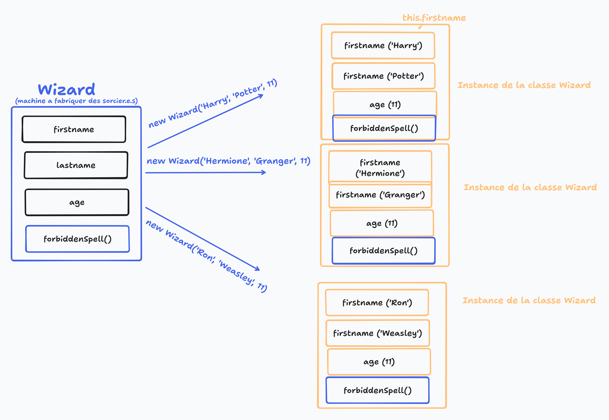
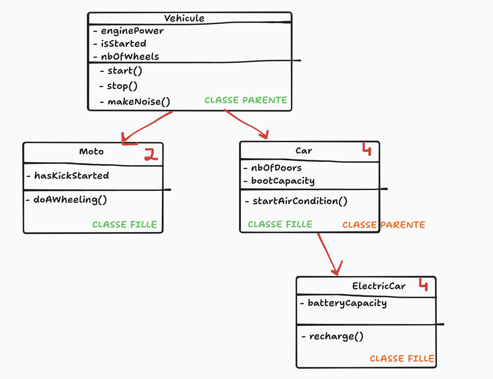

# Programmation Orienté Objet (POO)

(en 🇺🇸 OOP, Object-Oriented Programming)

## Disclamer 

En JavaScript, on pourrait complètement se passer de POO. Notamment, parce qu'on a déjà dans le language une **structure de données** pour représenter des objets : `{}`

Un objet dans le quotidien : une voiture, une personne, un animal domestique, ... tout ce qui a des propriétés et des valeurs

Au sens stricte, la `POO` est plutôt un **Design Pattern** : une solution (de code) courante à un problème courant

Exemple de Design Pattern : 
- `dataMapper` pour accéder à la BDD
- `MVC` un design pattern pour la gestion d'une app

## Pourquoi fait on de la POO cette saison ? 

- certains languages n'ont pas de structure de données pour représenter les objets de base (Java, Ruby, ...) => pédagogiquement interessant de savoir ça
- derrière la POO se cache un autre design pattern "Factory" très présent en JS
- très classique en programmation de manière général
- utilisé en JavaScript dans certaines cas, en particulier par des librairies ou du code natif : 
  - `new Date()`
  - `new Error()`
  - `Sequelize` => ORM qui arrive dans 2 jours => il utilise la POO + Active Record

- **Les classes peuvent servir à représenter nos entités / nos tables !**
  - ex: une classe `User` avec ses attributs !
  - nos classes représenteront ce qu'on appelle nos `modèles` MVC
  - **Objectif des jours suivants : écrire des classes CAPABLE d'aller communiquer avec la BDD !**
    - on change le design pattern d'accès au donnée (DAL Data Accès Layer). 
      - ❌ `dataMapper` ==> ✅ `Active Record`
      - une fois qu'on a vu comment on l'implémente => on utilisera un outil qui le fait à notre place : `Sequelize`


## La POO en Javascript

- les syntaxes de POO qu'on va apprendre aujourd'hui nous proviennent de `ES6` (2015) et avant il n'y en avait pas.
- on peut faire sans POO via le design pattern `Factory` en JavaScript pur

Objectif : 
- 15 min de conceptes sur les `Factory` de manière général en JS pur
- 1h de POO classique avec la syntaxe associée

## A retenir 

- `Factory` = Design Pattern = Fabrique à objet
- `class` = en POO, une façon d'écrire des factory. **Une Classe === un moule**
- A partir d'une classe, on peut instancier des objets. **Un objet === une instance**

- Une Classe a un `constructor`
- Pour appeler le `constructor`, on appelle le mot clé `new`

- `this` permet d'accéder à l'instance courante à l'intérieur de la classe.



## Opérateur ternaire 

```js
condition ? exprSiVrai : exprSiFaux;

// Exemple

console.log(6 / 2 === 3 ? "bonjour": "au revoir"); // Affichera 'bonjour'
console.log("oclock".includes("p") ? 10 : 20) // Affichera 20
```

Utilisez le uniquement pour obtenir une VALEUR en sortie. Ne pas l'utiliser avec des instructions !

```js
username === "James" ? console.log("Bonjour John") : console.log("Vous n'êtes pas autorisé");
```

## Attribut privé 

- C'est un attribut qu'on ne peut PAS modifier à l'extérieur de la classe.
- En JS, on le préfixe par `#`

## Getter 

- Fonction pour accéder à une propriété privée de l'instance de classe depuis l'extérieur
- avantages : 
  - on peut mettre un getter SANS mettre de setter (propriété en lecture seule !)

## Setter

- Fonction pour mettre à jour une propriété privée de l'instance de classe depuos l'extérieur
- avantages : 
  - on peut ajouter de la validation

## Exemple de classe en POO

```js
class Cat {
  // Attributs/Propriétés
  eyesColor;
  #age;
  #isHungry; // Propriété privée 
  isSleeping;

  // Constructeur
  constructor(eyesColor, age) { // Paramèters du contructeur
    this.eyesColor = eyesColor; // this = l'instance courante
    this.#age = age;
    this.#isHungry = true;
    this.isSleeping = false;
  }

  // Getter
  get isHungry() {
    return this.#isHungry;
  }

  // Setter (indirect)
  feed(ingredient) {
    if (ingredient === "chocolat") { throw new Error("On donne pas de chocolat au chat !"); }
    this.#isHungry = false;
  }

  // Méthode d'instance
  meow() {
    if (this.#isHungry) {
      console.log("Meeeeeow meowww meoowww croquette !");
    } else {
      console.log("Meow !");
    }
  }

  // Get 
  get age() {
    return this.#age;
  }

  // Set
  set age(value) {
    this.#age = value;
  }
}

const garfield = new Cat("blue", 42); // Une instance de la classe
console.log(garfield.isHungry); // true

garfield.feed("lasagne");
console.log(garfield.isHungry); // false

garfield.meow();

console.log(garfield.age); // 42
garfield.age = garfield.age + 1; 
console.log(garfield.age); // 43
```


## Héritage

Idée : 
- avoir une `classe mère` avec des propriétés et des méthodes
- créer une `classe fille` qui hérite des propriétés et méthodes de la `classe mère` MAIS en ajoutant des propriétés et méthodes complémentaires
- Note : dans le contructeur de la `classe fille`, il faut impérativement appeller le contructeur de la `classe mère`, qu'on appelle via `super()`



```js
class Wizard {
  firstname;
  house;

  constructor(firstname, house) {
    this.firstname = firstname;
    this.house = house;
  }

  castBasicSpell() {
    console.log("Windgardium Leviosaaaaaa !");
  }
}


class DarkWizard extends Wizard {
  score;

  constructor(firstname, score) {
    super(firstname, "serpentard");
    this.score = score;
  }

  castForbiddenSpell() {
    console.log("Avada Kedavra !");
  }
}

class Professor extends Wizard {
  subject;

  constructor(firstname, house, subject) {
    super(firstname, house);
    this.subject = subject;
  }

  addToPointsToHouse(nbOfPoints, houseName) {
    // ....
  }
}

const harry = new Wizard("Harry", "Griffondor");
harry.castBasicSpell(); // OK 
harry.castForbiddenSpell(); // PAS OK !

const voldy = new DarkWizard("Voldemort", 50000);
voldy.castBasicSpell(); // OK !
voldy.castForbiddenSpell(); // OK !
voldy.addToPointsToHouse(50, "Serpentard"); // PAS OK !

const snape = new Professor("Rogue/Severus", "Serpentard", "Potions");
snape.castBasicSpell(); // OK !
snape.castForbiddenSpell(); // PAS OK !
snape.addToPointsToHouse(50, "Pouffsouffle"); // OK 
```
